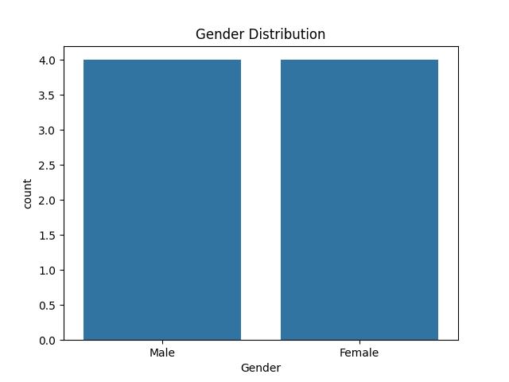
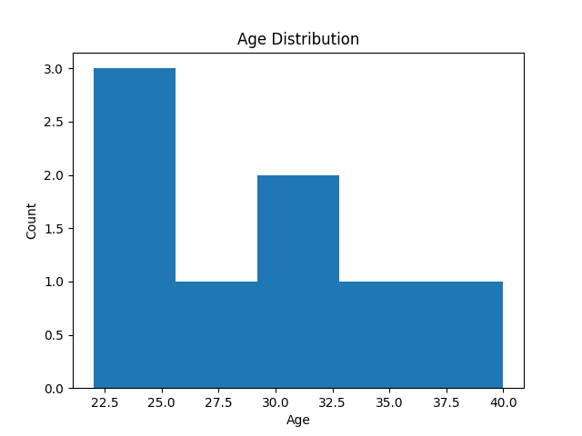

# 📊 Data Visualization (Prodigy InfoTech Task-01)

---

## 📌 Project Overview
This project focuses on visualizing data distributions using basic data visualization techniques.  
The goal is to create:

- 📊 Bar Chart for categorical data (Gender)
- 📈 Histogram for continuous data (Age)

These visualizations help in understanding patterns and distributions in a dataset.

---

## 🚀 Key Features

- 📊 **Bar Chart Visualization** – Displays gender distribution  
- 📈 **Histogram Visualization** – Shows age distribution  
- 🐍 Built using Python libraries  
- 📁 Saves output charts as images  

---

## 📂 Dataset

The dataset used contains simple demographic data:

- Age  
- Gender  

(Custom dataset created for demonstration)

---

## 🛠 Tech Stack

- **Language:** Python  
- **Libraries:** Pandas, Matplotlib, Seaborn  

---

## 📊 Results & Visualizations

### 📊 Gender Distribution

### 📈 Age Distribution

